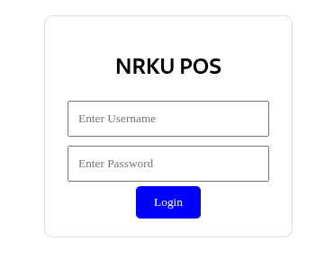
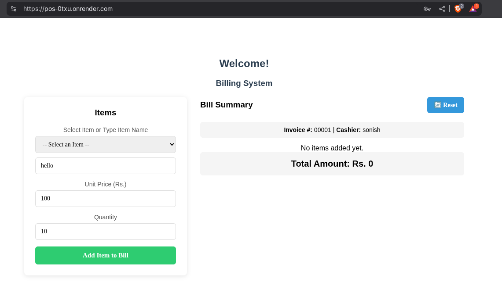
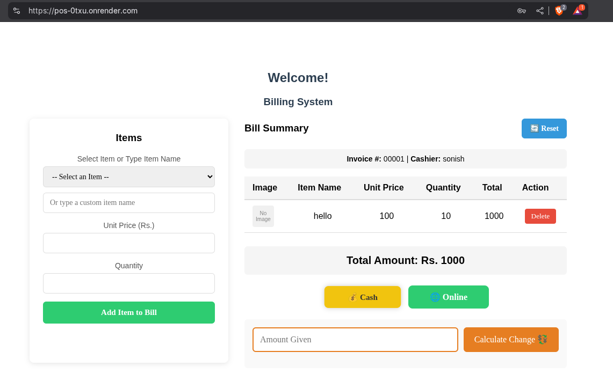

# POS Frontend System

This is a Point of Sale (POS) frontend system built with React.

## Prerequisites

- Node.js (version 14 or higher)
- npm (comes with Node.js)

## Setup Instructions

1. Install dependencies:
```bash
npm install
```

2. Start the development server:
```bash
npm start
```

The application will open in your default browser at `http://localhost:3000`


## 🖼️ Screenshots





## Login Credentials

The system comes with the following test credentials:

- Username: sonish, Password: test

## Features

- User authentication
- Billing system
- POS interface 
